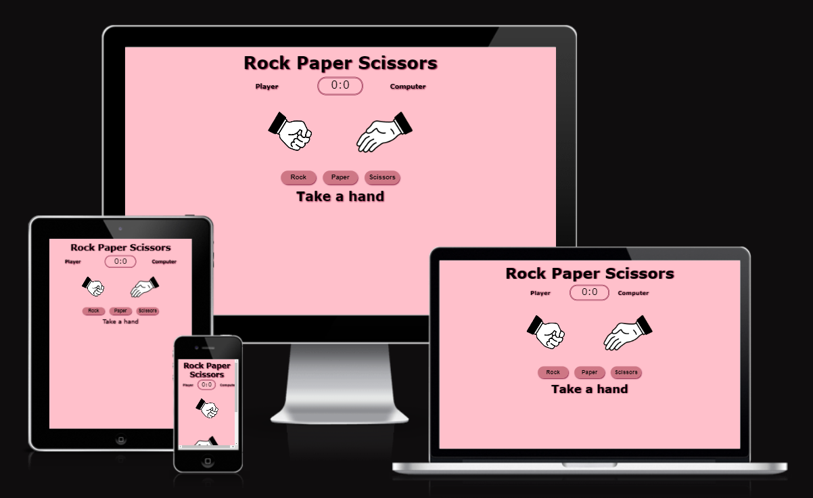
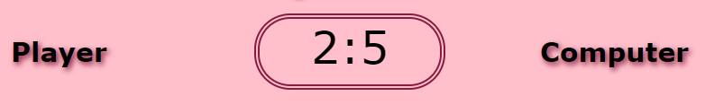
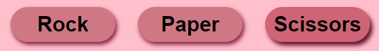
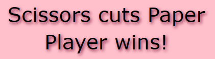
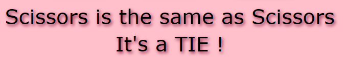
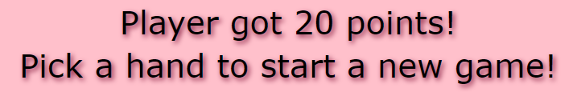
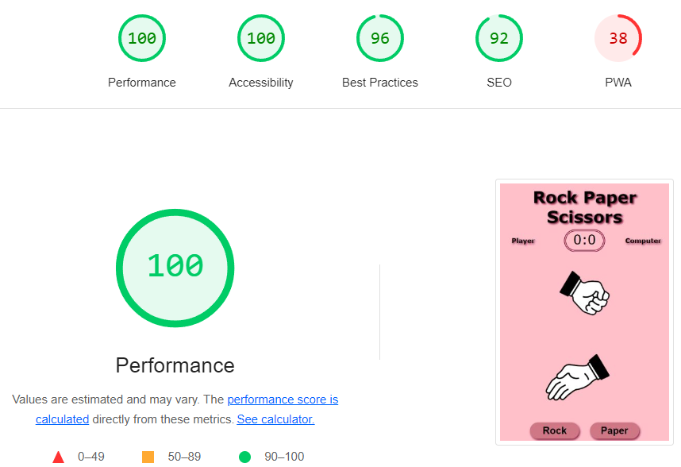
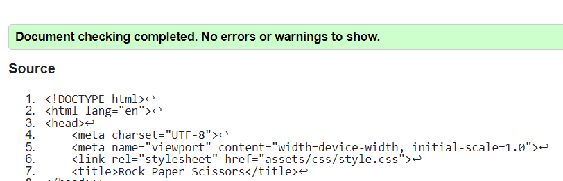
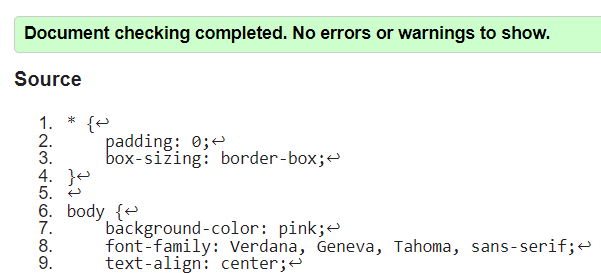

# RPS_Game

Rock Paper Scissors is a game, that almost everybody knows. This aplication lets the user play the game agains the computer. It gives the user tha chance to choose between the three possibilities and implements this choice with the one of the computer. It's totally a game of luck.

## Features

### Existing Features

* Header
    - Featured at the top of the page, the header shows the name of the game.

* The game score field
    - The game score field shows the user the score or how many times did the user or the computer win the game

* The Choices field
    - This announcement shows the user which option did both sides choose.

* The Choice Buttons
    - The buttons for Rock, Paper and Scissors are active buttons, that the user can click to make their choice and play the game.

* The Result announcement
    - Shows the player what did both sides choose , who beats who, and if there is a winner or it is a tie.
    - The game ends when one of the players reaches 20 pints. The score changes to 0:0 and the player can decide if he wants to play again.

    

## Testing

- I tested that the website works on different browsers.
- I confirmed that the game results are always correct.
- I confirmed that the application is readable and easy to understand.
- I confirmed that the colours and fonts are easy to read and accessible by running the app through lighthouse in devtools.

### Bugs

No bugs were found.

### Validator Testing

#### HTML

Got warning when passing through the official W3C validator, that the use of sections wasn't appropriate due to lack of headings. So all the sections were changed to div.

#### CSS

No errors were found when passing through the official (W3C) validator.

#### JSHint

JSHint was throwing up some warnings that were irrelevant, most of which I fixed. For example: 

8. Functions declared within loops referencing an outer scoped variable may lead to confusing semantics. (userInput, button, getComputerMove, compareMoves, changeImg)
13.	Missing semicolon.
15.	Unnecessary semicolon.
20.	'let' is available in ES6 (use 'esversion: 6') or Mozilla JS extensions (use moz).

### Lighthouse
The choosen colours and fontare easy to read and accessible by running it through Lighthouse in Devtools 

### Unfixed Bugs

No unfixed bugs were found.

## Deployment

The site was deployed to GitHub Pages using the following steps:

1. In the GitHub repository, navigate to the Settings tab.
2. From the source section drop-down menu, select the Master Branch.
3. Once the master branch is selected, the page will automatically refresh, indicating successful deployment.

The live link can be found here: [RPS_Game.01](https://desislavanaydenova.github.io/RPS_Game.01/)

## Credits

### Content

- The [Love Maths](https://learn.codeinstitute.net/courses/course-v1:CodeInstitute+LM101+2021_T1/courseware/2d651bf3f23e48aeb9b9218871912b2e/234519d86b76411aa181e76a55dabe70/) project tutorials wee used to develop this site.
- The look of the score field is inspired by [YouTube freeCodeCamp](https://www.youtube.com/watch?v=jaVNP3nIAv0)
- The changing hands are taken by [YouTube developedbyed](https://www.youtube.com/watch?v=qWPtKtYEsN4)

### Media

- The graphics are from [GitHub , developedbyed](https://github.com/developedbyed/rock-paper-scissor/tree/master/assets).
- Favicon from [Icons8.com](https://icons8.com/icons/set/favicon)